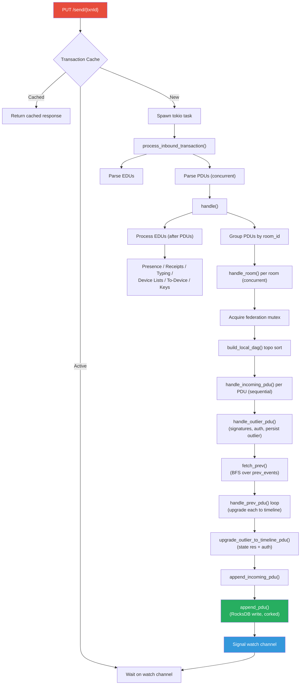
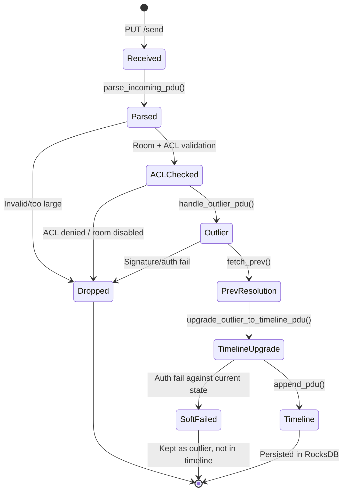
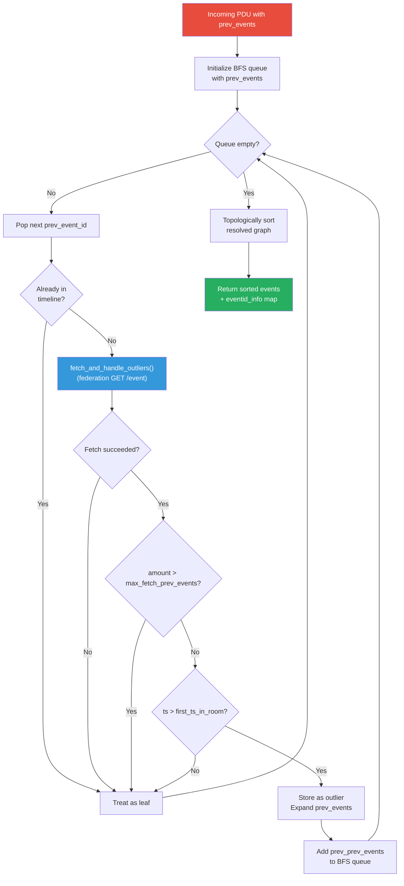
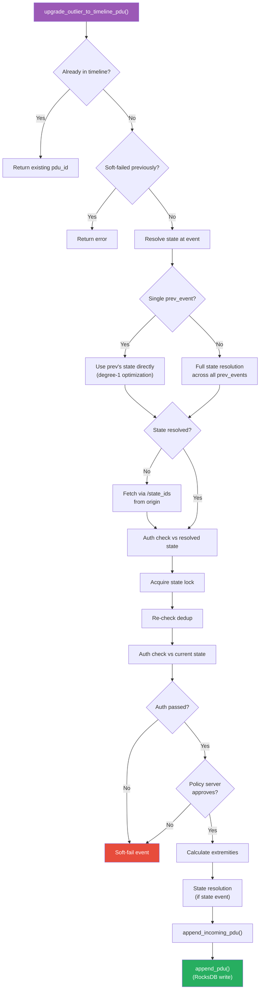
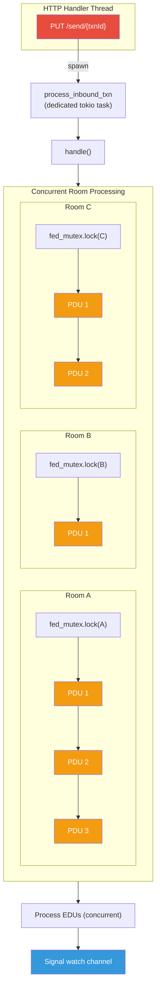
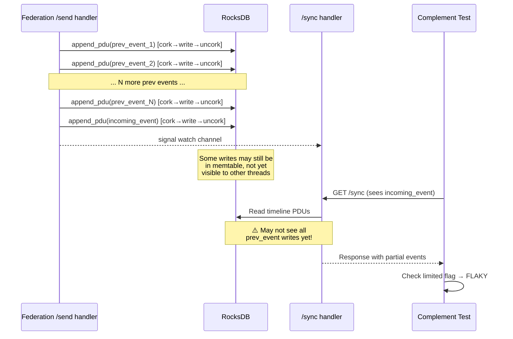
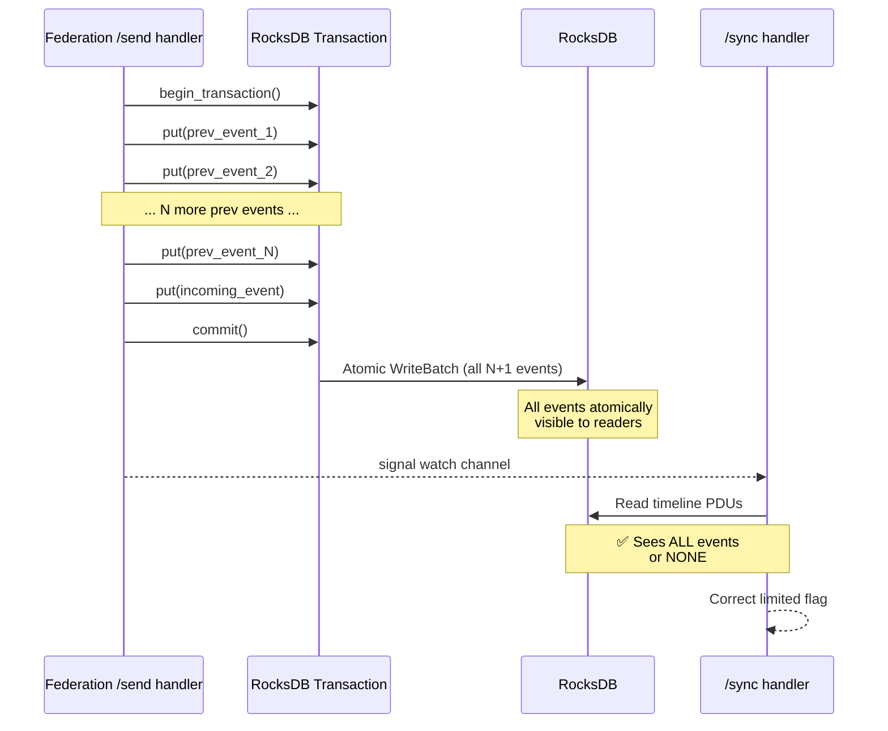

# Federation Event Intake Path

This document traces the full lifecycle of an incoming federation transaction, from
the initial `PUT /send/{txnId}` through prev-event resolution and RocksDB persistence.
It also documents known write-visibility races and their implications for sync
correctness.

## High-Level Architecture



## Table of Contents

- [Overview](#overview)
- [Key Files](#key-files)
- [Detailed Flow](#detailed-flow)
    - [1. Transaction Receipt](#1-transaction-receipt)
    - [2. PDU Parsing & Grouping](#2-pdu-parsing--grouping)
    - [3. Per-Room Processing](#3-per-room-processing)
    - [4. Incoming PDU Handling](#4-incoming-pdu-handling)
    - [5. Prev-Event Resolution](#5-prev-event-resolution)
    - [6. Outlier to Timeline Upgrade](#6-outlier-to-timeline-upgrade)
    - [7. RocksDB Persistence](#7-rocksdb-persistence)
    - [8. Post-Append Processing](#8-post-append-processing)
    - [9. Transaction Completion](#9-transaction-completion)
- [EDU Processing](#edu-processing)
- [Concurrency Model](#concurrency-model)
- [Write Visibility & Consistency](#write-visibility--consistency)
    - [Cork Mechanism](#cork-mechanism)
    - [Per-PDU Cork Scoping](#per-pdu-cork-scoping)
    - [Race Window](#race-window)
    - [Potential Fix: RocksDB Transactions](#potential-fix-rocksdb-transactions)
- [Configuration Knobs](#configuration-knobs)
- [Error Handling & Backoff](#error-handling--backoff)
- [Known Issues](#known-issues)

---

## Overview

When a remote server sends events via `PUT /_matrix/federation/v1/send/{txnId}`,
the following pipeline executes:

```
PUT /send/{txnId}  (send.rs:60)
  │
  ├─ Duplicate/active check via transactions service
  │    ├─ Cached → return cached response (idempotent)
  │    ├─ Active → wait on watch::Receiver (join in-progress)
  │    └─ Started → spawn processing task, wait on watch::Receiver
  │
  └─ process_inbound_transaction()  [spawned tokio task]  (send.rs:142)
       │
       ├─ Parse PDUs via event_handler.parse_incoming_pdu()
       │    └─ Concurrent (broad_then), invalid PDUs logged & dropped
       │
       ├─ Parse EDUs via serde_json::from_str()
       │    └─ Invalid EDUs silently dropped
       │
       └─ handle()  (send.rs:232)
            │
            ├─ Group PDUs by room_id (sort + grouping_map)
            │
            ├─ handle_room() per room  [concurrent across rooms]  (send.rs:340)
            │    ├─ Acquire federation mutex for room
            │    ├─ Topologically sort PDUs (build_local_dag)
            │    └─ For each PDU (sequential):
            │         └─ handle_incoming_pdu()  (handle_incoming_pdu.rs:118)
            │              │
            │              ├─ Check: already in timeline? → return existing pdu_id
            │              ├─ Check: PDU fits size limit (65535 bytes)?
            │              ├─ Check: room exists, not disabled, ACL passes
            │              ├─ Check: server is participating in room
            │              │
            │              ├─ handle_outlier_pdu()     [step 7: persist as outlier]
            │              │    ├─ Signature verification
            │              │    ├─ Content hash check (redact if mismatch)
            │              │    ├─ Fetch missing auth events
            │              │    └─ Auth check against auth events
            │              │
            │              ├─ fetch_prev()  [step 9: resolve missing prev_events]
            │              │    └─ BFS over prev_events graph
            │              │         ├─ fetch_and_handle_outliers() per unknown event
            │              │         │    └─ Federation GET /event/{eventId}
            │              │         ├─ Bounded by max_fetch_prev_events config
            │              │         ├─ Skip events older than room's first event
            │              │         └─ Topologically sort resolved graph
            │              │
            │              ├─ handle_prev_pdu() loop   [upgrade each prev to timeline]
            │              │    ├─ Exponential backoff on recently-failed events
            │              │    ├─ Skip events older than room's first event
            │              │    └─ upgrade_outlier_to_timeline_pdu()
            │              │         ├─ Resolve state at event (degree-1 or full state res)
            │              │         ├─ Fetch missing state via /state_ids if needed
            │              │         ├─ Auth check against resolved state
            │              │         ├─ Soft-fail check (auth + policy server + redaction)
            │              │         ├─ Calculate new forward extremities
            │              │         ├─ State resolution for new room state
            │              │         └─ append_incoming_pdu() → append_pdu()
            │              │
            │              └─ upgrade_outlier_to_timeline_pdu()  [incoming event itself]
            │                   └─ Same pipeline as above
            │
            └─ Process EDUs (after all PDUs)
                 ├─ Presence updates
                 ├─ Read receipts
                 ├─ Typing notifications
                 ├─ Device list updates
                 ├─ Direct-to-device messages
                 └─ Signing key updates
```

## Event Lifecycle State Machine



## Key Files

| File                                                     | Role                                               |
| -------------------------------------------------------- | -------------------------------------------------- |
| `src/api/server/send.rs`                                 | Federation `/send` route handler, PDU/EDU dispatch |
| `src/service/rooms/event_handler/handle_incoming_pdu.rs` | Main PDU processing pipeline (steps 1-14)          |
| `src/service/rooms/event_handler/fetch_prev.rs`          | Prev-event graph walking and federation fetch      |
| `src/service/rooms/event_handler/handle_prev_pdu.rs`     | Upgrade individual prev events to timeline         |
| `src/service/rooms/event_handler/upgrade_outlier_pdu.rs` | State resolution + append to timeline              |
| `src/service/rooms/timeline/append.rs`                   | Final RocksDB persistence (`append_pdu`)           |
| `src/service/rooms/timeline/data.rs`                     | Low-level DB operations (PDU storage, indices)     |
| `src/service/transactions/mod.rs`                        | Transaction dedup cache and lifecycle              |
| `src/database/cork.rs`                                   | Write coalescing mechanism                         |
| `src/database/engine.rs`                                 | RocksDB engine wrapper                             |

---

## Detailed Flow

### 1. Transaction Receipt

**File:** `src/api/server/send.rs:60`

The `send_transaction_message_route` handler validates the transaction:

- Origin server matches the authenticated sender
- PDU count ≤ `PDU_LIMIT`
- EDU count ≤ `EDU_LIMIT`

It then checks the transaction cache via the `transactions` service:

```rust
match services.transactions.get_or_start_federation_txn(txn_key.clone())? {
    FederationTxnState::Cached(response) => Ok(response),        // Already done
    FederationTxnState::Active(receiver) => wait_for_result(receiver).await, // Join
    FederationTxnState::Started { receiver, sender } => {
        // We're first — spawn processing task
        services.server.runtime().spawn(
            process_inbound_transaction(services, body, client, txn_key, sender)
        );
        wait_for_result(receiver).await  // Block up to 50s
    },
}
```

The `wait_for_result` function uses `tokio::time::timeout(Duration::from_secs(50), ...)`
and returns HTTP 429 `LimitExceeded` if the transaction takes too long.

### 2. PDU Parsing & Grouping

**File:** `src/api/server/send.rs:150`

PDUs are parsed concurrently via `broad_then` (parallel processing):

```rust
let pdus = body.pdus.iter().stream()
    .broad_then(|pdu| services.rooms.event_handler.parse_incoming_pdu(pdu))
    .inspect_err(|e| warn!("Could not parse incoming PDU: {e}"))
    .ready_filter_map(Result::ok);
```

Inside `handle()`, PDUs are collected, sorted by room_id, and grouped using
`into_grouping_map_by`. This ensures all PDUs for the same room are processed
together.

### 3. Per-Room Processing

**File:** `src/api/server/send.rs:340`

Each room is processed under a federation mutex to prevent concurrent modification:

```rust
let _room_lock = services.rooms.event_handler.mutex_federation.lock(&room_id).await;
```

If ≥2 PDUs exist for the same room, they are topologically sorted via
`build_local_dag()`, which constructs a local DAG from their `prev_events`
fields and applies `lexicographical_topological_sort`. This ensures PDUs are
processed in dependency order.

PDUs are then processed **sequentially** within the room:

```rust
for event_id in sorted_event_ids {
    let result = services.rooms.event_handler
        .handle_incoming_pdu(origin, room_id, &event_id, value, true)
        .await
        .map(|_| ());
    results.push((event_id, result));
}
```

### 4. Incoming PDU Handling

**File:** `src/service/rooms/event_handler/handle_incoming_pdu.rs:118`

This implements the Matrix federation event processing algorithm (spec steps 1-14):

1. **Skip if known** — return early if `get_pdu_id(event_id)` succeeds
2. **Size check** — drop PDUs exceeding 65535 bytes
3. **Room validation** — concurrent checks via `try_join4`:
    - Room metadata exists
    - Room not disabled
    - Origin server passes ACL
    - Sender's server passes ACL (if different from origin)
4. **Participation check** — our server must be in the room (special handling
   for membership events in known rooms)
5. **Outlier processing** — `handle_outlier_pdu()` verifies signatures, content
   hash, fetches missing auth events, and persists as outlier
6. **Prev-event resolution** — `fetch_prev()` walks the DAG backward
7. **Prev-event upgrade** — each prev event upgraded to timeline
8. **Incoming event upgrade** — the event itself upgraded to timeline

### 5. Prev-Event Resolution



**File:** `src/service/rooms/event_handler/fetch_prev.rs:25`

A bounded BFS using a `VecDeque` stack:

```rust
while let Some(prev_event_id) = todo_outlier_stack.pop_front() {
    match self.fetch_and_handle_outliers(origin, once(prev_event_id), ...).await.pop() {
        Some((pdu, json_opt)) => {
            if amount > max_fetch_prev_events { /* cap reached, leaf node */ }
            if pdu.origin_server_ts() > first_ts_in_room {
                // Expand: add prev_events to stack
                for prev_prev in pdu.prev_events() {
                    if !graph.contains_key(prev_prev) {
                        todo_outlier_stack.push_back(prev_prev.to_owned());
                    }
                }
            } else {
                // Too old, treat as leaf
            }
        }
        None => { /* Fetch failed, treat as leaf */ }
    }
}
```

**Key bounds:**

- `max_fetch_prev_events` — config limit on total events fetched per gap
- Timestamp cutoff — events older than the room's first event are not expanded
- Each fetched event is stored as an **outlier** only (not in the timeline yet)

The resolved graph is topologically sorted before returning.

### 6. Outlier to Timeline Upgrade



**File:** `src/service/rooms/event_handler/upgrade_outlier_pdu.rs:20`

This is the most complex step, handling state resolution:

1. **Dedup check** — skip if already in timeline or soft-failed
2. **State at event** — resolve via:
    - Degree-1: single prev_event → use its state directly
    - Multi-prev: full state resolution across all prev_events
    - Fallback: fetch via `/state_ids` from origin
3. **Auth check** — against resolved state
4. **Room state lock** — `self.services.state.mutex.lock(room_id).await`
5. **Re-check dedup** — another handler may have processed it while waiting
6. **Auth check** — against current room state (with auth events)
7. **Soft-fail evaluation**:
    - Failed auth → soft-fail
    - Policy server rejection → soft-fail
    - Redaction of soft-failed event → soft-fail
8. **Forward extremities** — calculate new extremity set
9. **State persistence** — if state event, derive and persist new room state
10. **Timeline append** — `append_incoming_pdu()` → `append_pdu()`

### 7. RocksDB Persistence

**File:** `src/service/rooms/timeline/append.rs:107`

The `append_pdu` function performs the actual database write:

```rust
// Coalesce database writes for the remainder of this scope.
let _cork = self.db.db.cork();

let shortroomid = self.services.short.get_shortroomid(room_id).await?;

// Prepare unsigned fields (prev_content for state events)
// Mark prev_events as referenced
// Set forward extremities
// Acquire insert mutex

let count1 = self.services.globals.next_count().unwrap();
// Mark as read for sender
// Reset notification counts for sender

let count2 = PduCount::Normal(self.services.globals.next_count().unwrap());
let pdu_id = PduId { shortroomid, shorteventid: count2 }.into();

// Persist to RocksDB
self.db.append_pdu(&pdu_id, pdu, &pdu_json, count2).await;
```

The `db.append_pdu()` writes to multiple column families:

- `pduid_pdu` — the PDU JSON keyed by pdu_id
- `eventid_pduid` — event_id → pdu_id mapping
- `roomid_pduleaves` — forward extremities update
- `roomid_timestamp_pducount` — timestamp index (25-byte packed key)

### 8. Post-Append Processing

After the PDU is persisted, `append_pdu` also handles:

- **Push notifications** — evaluate push rules for local users, queue pushes
- **Notification counts** — increment highlight/notification counters
- **Redaction** — if this is a redaction event, redact the target
- **Search indexing** — index message body for full-text search
- **Relations** — record reply/thread/reaction relationships
- **Appservice dispatch** — notify registered appservices
- **Space hierarchy** — invalidate cache on `m.space.child` events
- **Membership** — update state cache on `m.room.member` events

### 9. Transaction Completion

**File:** `src/api/server/send.rs:190`

After all PDUs and EDUs are processed:

```rust
let response = send_transaction_message::v1::Response {
    pdus: results.into_iter()
        .map(|(e, r)| (e, r.map_err(error::sanitized_message)))
        .collect(),
};

services.transactions.finish_federation_txn(txn_key, sender, response);
```

The response includes per-PDU success/error results. The transaction is cached
for future idempotent retries. The `watch::Sender` signals all waiters.

---

## EDU Processing

**File:** `src/api/server/send.rs:264`

EDUs are processed **after** all PDUs, concurrently:

| EDU Type           | Handler                         | Condition                             |
| ------------------ | ------------------------------- | ------------------------------------- |
| Presence           | `handle_edu_presence`           | `allow_incoming_presence` config      |
| Read Receipts      | `handle_edu_receipt`            | `allow_incoming_read_receipts` config |
| Typing             | `handle_edu_typing`             | `allow_incoming_typing` config        |
| Device List Update | `handle_edu_device_list_update` | Always                                |
| Direct-to-Device   | `handle_edu_direct_to_device`   | Always (with txn dedup)               |
| Signing Key Update | `handle_edu_signing_key_update` | Always                                |

Each EDU type validates that the sender belongs to the origin server.

---

## Concurrency Model



**Key locks:**

- **Federation mutex** (`mutex_federation`) — per-room, prevents concurrent
  federation processing for the same room
- **State mutex** (`state.mutex`) — per-room, held during state resolution and
  timeline append in `upgrade_outlier_to_timeline_pdu`
- **Insert mutex** (`mutex_insert`) — per-room, held during the PduCount
  assignment and DB write to ensure monotonic ordering

---

## Write Visibility & Consistency

### Cork Mechanism

**File:** `src/database/cork.rs`

The cork is a write-coalescing mechanism that increments an atomic counter:

```rust
pub(crate) fn cork(&self) { self.corks.fetch_add(1, Ordering::Relaxed); }
pub(crate) fn uncork(&self) { self.corks.fetch_sub(1, Ordering::Relaxed); }
pub fn corked(&self) -> bool { self.corks.load(Ordering::Relaxed) > 0 }
```

Three variants exist:

- `cork()` — coalesce only, no flush on drop
- `cork_and_flush()` — flush WAL on drop (non-blocking)
- `cork_and_sync()` — flush + sync WAL on drop (blocking, durable)

`append_pdu` uses plain `cork()` — **no explicit flush or sync on drop**.

### Per-PDU Cork Scoping

Each `append_pdu` call creates and drops its own cork. When processing N prev
events from a single federation transaction, this results in N separate write
batches submitted to RocksDB:

```
handle_prev_pdu(prev_1) → append_pdu → cork → write → uncork
handle_prev_pdu(prev_2) → append_pdu → cork → write → uncork
...
handle_prev_pdu(prev_N) → append_pdu → cork → write → uncork
upgrade_outlier(incoming) → append_pdu → cork → write → uncork
```

There is **no transactional guarantee** that all N+1 writes are atomically
visible to other threads.

### Race Window



The `watch::Sender::send()` provides a happens-before relationship for the
channel message, but **not** for RocksDB reads on the receiving thread.
RocksDB's default `ReadOptions` read from the latest memtable + SST state,
but there's a window where the memtable write from thread A may not be fully
visible to thread B's read iterator.

This manifests as the **TestSyncTimelineGap flakiness** in Complement tests:
the test waits for the "End" event to appear in sync, which means the
transaction handler has completed, but some prev events may not yet be visible
in the `/sync` read path.

### Potential Fix: RocksDB Transactions



A `TransactionDB` or `OptimisticTransactionDB` with `WriteBatchWithIndex`
would address this:

1. **Atomic batch writes** — All events from a single federation transaction
   are written in one `WriteBatch`, atomically visible to readers.
2. **Read-your-writes** — Pending writes are visible to reads within the same
   transaction context.
3. **Snapshot isolation** — `/sync` reads get a consistent snapshot that either
   sees ALL events from a federation transaction or NONE.

The scope of the transaction would wrap `handle_room()` — all PDUs for one room
in one federation transaction would be committed atomically. This ensures that
when the "End" event is visible, all backfilled prev events are guaranteed to
be visible in the same read snapshot.

**Alternative: Wider cork scope** — A simpler fix would be to create a single
`cork_and_flush()` around the entire `handle_room()` loop, ensuring all PDU
writes for a room are coalesced into one write batch and flushed before the
transaction signals completion. This would not provide true snapshot isolation
but would reduce the race window significantly.

---

## Configuration Knobs

| Config Key                     | Default | Effect                                 |
| ------------------------------ | ------- | -------------------------------------- |
| `max_fetch_prev_events`        | varies  | Limits BFS depth in `fetch_prev`       |
| `allow_incoming_presence`      | true    | Enable/disable presence EDU processing |
| `allow_incoming_read_receipts` | true    | Enable/disable receipt EDU processing  |
| `allow_incoming_typing`        | true    | Enable/disable typing EDU processing   |
| `typing_federation_timeout_s`  | varies  | TTL for federated typing indicators    |

---

## Error Handling & Backoff

### Bad Event Ratelimiter

**File:** `src/service/rooms/event_handler/handle_incoming_pdu.rs:271`

Failed prev events are tracked in `bad_event_ratelimiter` with exponential
backoff:

```rust
match self.services.globals.bad_event_ratelimiter.write().entry(prev_id.into()) {
    Vacant(e) => { e.insert((Instant::now(), 1)); },
    Occupied(mut e) => {
        let tries = e.get().1.saturating_add(1);
        *e.get_mut() = (Instant::now(), tries);
    },
}
```

Backoff parameters: `MIN_DURATION = 5 minutes`, `MAX_DURATION = 24 hours`.

### Transaction-Level Errors

If `handle()` returns an error (e.g., server shutting down), the transaction is
removed from the active set (allowing retry) and the error is sent to all waiters
via the watch channel.

### Per-PDU Results

Each PDU gets an individual success/error result in the `/send` response. A
single PDU failure does not abort processing of other PDUs. Error messages are
sanitized before being included in the response.

---

## Known Issues

### TestSyncTimelineGap Flakiness

The Complement `TestSyncTimelineGap` test is flaky due to the write-visibility
race described above. The test creates 50 events without sending them, then sends
one "End" event via federation. The server resolves the gap via `/get_missing_events`
(which returns only the last 10 events), then the test checks sync for a `limited`
flag.

The flakiness occurs because:

1. The `/get_missing_events` handler returns only 10 events
2. Additional events may or may not be resolved via `/event/{eventId}` calls
3. With a sync filter `limit: 20`, total events hover right at the boundary
4. The per-PDU cork scoping means writes may not all be visible at sync time

### PduCount Ordering

Prev events resolved from federation all receive `PduCount::Normal` values
(monotonically increasing). This means they appear **after** the sync token
in chronological ordering, even though they logically occurred before the
incoming event. This is correct for the sync timeline (they are "new" to this
server), but can cause confusion when reasoning about event ordering.
